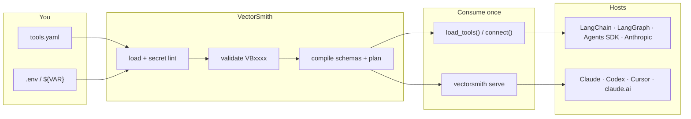

<div align="center">


# VectorSmith

**Your vector database, forged into tools an agent can actually use.**

Write a `tools.yaml`. VectorSmith compiles it into typed, tenant-guarded tools — then you either `import` them in Python or `serve` them over MCP.

[](LICENSE)
[](pyproject.toml)
[](docs/tools-yaml-reference.md)
[](docs/integrations/README.md)
[](CHANGELOG.md)
[](docs/conformance.md)
[](https://kjgpta.github.io/vectorsmith/)

[What it is](#why-this-exists) · [How it works](#how-it-works) · [Write YAML](#write-a-tool-not-a-prompt) · [Python](#in-your-agent-python) · [Claude / Codex / Cursor](#in-claude-codex-cursor) · [Production HTTP](#production-http-server) · [Backend evidence](#stores) · [Try it](#try-it) · [**Docs**](https://kjgpta.github.io/vectorsmith/)

</div>

---

## Why this exists

Agents that talk to *your* invoices, tickets, or catalog usually get one of two bad options:

| Typical approach | What goes wrong |
|---|---|
| Vendor MCP (Qdrant / Pinecone / …) | Cluster admin tools. Upsert, delete, create-collection. The model can wander. |
| Hand-bind JSON schemas to LangChain / the OpenAI SDK | You re-implement filters, limits, and tenant isolation in Python. Every agent copies it. |
| “Just embed and `search()` in the system prompt” | No typed args. No enums. No hidden `tenant = acme`. |

VectorSmith is the third option: **the data store stays yours. The tools are a YAML contract.** The compiler turns that contract into MCP schemas or in-process tools. The agent never sees the URL, the API key, or the tenant filter.

```text
  you write                         VectorSmith                    the agent sees
─────────────                   ─────────────────                ────────────────
 tools.yaml          ──▶   interpolate → validate → compile  ──▶  search_invoices
 tenant: acme                    Engine stays internal            query, client, status
 ${QDRANT_URL}                                                    (no tenant, no URL)
```

<p align="center">
  <video src="docs/assets/demo-launch.mp4" poster="docs/assets/demo-launch-thumb.png" width="980" controls playsinline preload="metadata">
    <a href="docs/assets/demo-launch.mp4"></a>
  </video>
  <br />
  <sup><a href="docs/assets/demo-launch.mp4">Watch the 50s demo</a> · YAML → Claude / Cursor / Python</sup>
</p>

---

## How it works



One file, two doors. Same compiled tools.

<div align="center">

| | **Python app** | **Chat / IDE host** |
|---|---|---|
| Install | `pip install "vectorsmith[qdrant,langchain]"` | `pip install "vectorsmith[qdrant]"` so `vectorsmith` is on `PATH` |
| Call | `from vectorsmith import load_tools` | `vectorsmith serve tools.yaml --name invoices` |
| Process | In-process. No subprocess. | The host **spawns** the CLI (MCP stdio or HTTP) |
| Mix-in | Your `@tool`s + Slack/GitHub via an MCP client | Other `mcpServers` keys sit next to it |

</div>

You do **not** import an executor. You do **not** copy `inputSchema` into the LLM SDK.

---

## Write a tool, not a prompt

A tool is a name, a description (so the model *picks* it), a collection, optional text search, parameters the model may pass, and filters it **must never** see:

```yaml
tds_version: "1"

connections:
  invoices:
    backend: qdrant
    url: ${QDRANT_URL}              # secrets only here, only as ${VAR}
    api_key: ${QDRANT_API_KEY:-}

tools:
  - name: search_invoices
    kind: search
    description: >
      Search invoices by free text and filter by client, status, or amount.
      Use when the user asks about invoices, billing, or payments.
    target: { connection: invoices, collection: invoices }
    query: { param: query, required: false }
    static_filters:
      - { path: tenant, op: eq, value: acme }    # hidden from the model
    parameters:
      - { name: client, path: client_name, dtype: keyword, op: eq }
      - { name: status, path: status, dtype: keyword, op: in,
          enum: [draft, sent, paid, overdue] }
      - { name: min_amount, path: amount, dtype: float, op: gte }
    output:
      fields: [invoice_id, client_name, status, amount]
      limit_default: 10
      limit_max: 50
```

`vectorsmith init ./demo` writes a starter file. The full field list — kinds, operators, pipelines, built-ins, every backend — is in **[docs/tools-yaml-reference.md](docs/tools-yaml-reference.md)**.

### What the model sees

```json
{
  "name": "search_invoices",
  "description": "Search invoices by free text and filter by client, status, or amount. …",
  "inputSchema": {
    "type": "object",
    "properties": {
      "query": { "type": "string" },
      "client": { "type": "string" },
      "status": {
        "type": "array",
        "items": { "type": "string", "enum": ["draft", "sent", "paid", "overdue"] }
      },
      "min_amount": { "type": "number" },
      "limit": { "type": "integer", "minimum": 1, "maximum": 50, "default": 10 }
    }
  }
}
```

`tenant: acme` is **not** in that schema. The engine ANDs it on every call. Credentials never leave `connections`.

### Kinds you can declare

| `kind` | For | Typical tool |
|---|---|---|
| `search` | Semantic retrieve + filters | `search_invoices` |
| `lookup` | Exact id, limit 1 | `get_invoice` |
| `count` | “How many overdue?” | `count_invoices` |
| `scroll` | Filter / page, no ANN | list-style tools |
| `pipeline` | Retrieve → `post_filter` / `group_by` / `sort` / `project` | top-N per client |

Built-ins (`search_<connection>`, `get_<connection>_by_id`, …) are **opt-in** on the connection. Turn them off if you already named a user tool the same way.

---

## In your agent (Python)

```bash
pip install "vectorsmith[qdrant,langchain]"
```

```python
from vectorsmith import load_tools
from langchain.agents import create_agent

tools = load_tools("tools.invoices.yaml", "tools.tickets.yaml")
agent = create_agent("openai:gpt-4.1", tools)
# … await tools.aclose()
```

Same YAML, other stacks:

```python
from vectorsmith.langgraph import load_tools      # create_react_agent / ToolNode
from vectorsmith.openai_agents import load_tools  # Agent + Runner
from vectorsmith.anthropic import load_tools      # messages.create(tools=vs.tools)
from vectorsmith import connect                   # await vs.call("search_invoices", {…})
```

Authenticated Python applications can pass `ctx=CallContext(...)` to
`BoundTools.call()`. Supported LangChain/LangGraph, OpenAI Agents, and Anthropic
paths propagate that principal, claims/roles, tenant, deadline, and request ID.
The application is responsible for constructing caller context from an
authenticated request. See the [Python API](docs/python-api.md) and
[security profiles](docs/security-hardening.md#identity-profiles-are-not-interchangeable).

| Extra | Import |
|---|---|
| `vectorsmith[langchain]` | `from vectorsmith import load_tools` |
| `vectorsmith[langgraph]` | same tools; LangGraph graph |
| `vectorsmith[openai-agents]` | `from vectorsmith.openai_agents import load_tools` |
| `vectorsmith[anthropic]` | `from vectorsmith.anthropic import load_tools` |

Worked apps: [`examples/langchain_agent`](examples/langchain_agent/) · [`langgraph_agent`](examples/langgraph_agent/) · [`openai_agents`](examples/openai_agents/) · [`anthropic_agent`](examples/anthropic_agent/).

---

## In Claude, Codex, Cursor

Those products cannot `import vectorsmith`. They spawn a process. Point them at `serve` with the **same YAML**.

```json
{
  "mcpServers": {
    "invoices": {
      "command": "vectorsmith",
      "args": ["serve", "tools.invoices.yaml", "--name", "invoices"]
    }
  }
}
```

Codex is TOML (`~/.codex/config.toml`), not JSON. Claude Code uses `.mcp.json` — it does **not** read the Desktop file.

| Host | Config | Guide |
|---|---|---|
| Claude Desktop | `claude_desktop_config.json` | [docs/integrations/claude-desktop.md](docs/integrations/claude-desktop.md) |
| Claude Code | `.mcp.json` / `claude mcp add` | [docs/integrations/claude-code.md](docs/integrations/claude-code.md) |
| OpenAI Codex | `~/.codex/config.toml` | [docs/integrations/openai-codex.md](docs/integrations/openai-codex.md) |
| Cursor | `.cursor/mcp.json` | [docs/integrations/cursor.md](docs/integrations/cursor.md) |
| claude.ai | `serve --http --auth builtin` | [docs/quickstart-selfhost.md](docs/quickstart-selfhost.md) |

Copy-paste snippets: [`examples/mcp_hosts/`](examples/mcp_hosts/). Slack, GitHub, filesystem stay **separate** servers — [coexistence](docs/coexistence.md).

---

## Production HTTP server

`0.2.0` is the production HTTP cut. `vectorsmith serve --http` is Streamable HTTP MCP (`POST /mcp`) for claude.ai, gateways, and Kubernetes. Every `security.*` / `observability.*` / credential / `profiles.enterprise` knob in YAML is applied at process start — the same contract `connect` / `load_tools` use in-process.

That describes the HTTP runtime, not stable backend status. All six adapters
currently remain experimental; see [backend evidence](docs/conformance.md)
before making a production support claim.

```bash
pip install "vectorsmith[qdrant,auth-jwt,otel]"

vectorsmith serve tools.yaml --http 0.0.0.0:8080 --auth jwt \
  --jwks-url https://auth.example.com/.well-known/jwks.json \
  --jwt-issuer https://auth.example.com --jwt-audience vectorsmith \
  --log-format json --live-embed
```

Localhost demo: `--http 127.0.0.1:8080 --auth none`. `--auth none` off loopback exits `3`. Builtin OAuth (`--auth builtin`, the HTTP default) needs `https://` `--public-url`.

| Concern | How |
|---|---|
| Who is calling | `--auth jwt` (JWKS / RS256) · `api_key` · `builtin` OAuth. Extra `vectorsmith[auth-jwt]` |
| Tenant isolation | Hidden `static_filters` **and/or** `security.tenancy` (`claim` / `header`). Pick one layer unless you intend both |
| Which tools | `security.rbac` (`roles`, `deny_tools`). Applied on the inner name of `run_tool` |
| Secrets | `connections.*.credentials.provider`: `env` · `vault` · `aws_sm` · `k8s`. Extra `vectorsmith[creds-aws]` |
| Quotas | `security.rate_limit` (off by default). In-memory or Redis (`vectorsmith[auth-redis]`). HTTP **429** |
| Health | `GET /healthz` (liveness). `GET /readyz` **503** if a connection, required embedder, or JWT JWKS is down |
| Observability | `--log-format json` (`request_id`, `trace_id`, `span_id`). `observability.tracing` → OTLP (`vectorsmith[otel]`). `GET /metrics`. Audit file / HTTP / OTLP |
| Hardening | `profiles.enterprise` + `validate --enterprise --strict`. Refuses `serve` / `connect` if tenancy / limits / backends fail |
| Search quality | Pluggable embedders, `query.expand`, `tool.rerank` (`http` / `cohere` / local `cross_encoder`) |
| Many catalogs | Extra YAML args, `--route-by-claim`, `--default-project`. Duplicate tool names fail at start |
| Drain | `--shutdown-grace-s` (default 30). New `POST /mcp` is **503** while draining |

Reference catalog: [`examples/enterprise/`](examples/enterprise/). Chart and probes: [Kubernetes](docs/deploy/kubernetes.md). Full model: [enterprise](docs/enterprise.md) · [hardening](docs/security-hardening.md) · [observability](docs/observability.md).

---

## Stores

`backend` on a connection is one of six adapters. All currently have
**experimental** support status: the advertised read-only surface is usable and
tested, but the complete fault and supported-version matrix required for stable
status is not finished. Unsupported semantics fail validation instead of
silently returning partial or unfiltered results.

`qdrant` · `pgvector` · `chroma` · `pinecone` · `weaviate` · `milvus`

The deterministic local matrix covers hidden tenant filters, exact IDs, counts,
pagination, projection, nested and array filters, hybrid ranking, typed
introspection, server-side embedding, score direction, edge-case payloads,
read-only builtins/drafts, cleanup, and error translation. Current generated
pass/skip counts and tested client/server versions are in
**[backend conformance](docs/conformance.md)** for exact server/client versions,
per-backend results, tested behavior, and remaining stability blockers.

The current capability matrix advertises hybrid search only for Qdrant and
Weaviate. pgvector can run in **table mode** (no vector column) for lookup,
count, scroll, and pipelines. Pinecone intentionally rejects filter-only
scroll, filtered count, hybrid mode, and exact-ID builtins that cannot preserve
metadata guardrails. Full operator and feature details:
**[vector stores](docs/vector-stores.md)**.

Production extras (install what you turn on in YAML):

| Extra | For |
|---|---|
| `auth-jwt` | `serve --auth jwt` |
| `auth-redis` | Shared OAuth tokens and Redis rate limits |
| `otel` | OTLP traces from `observability.tracing` |
| `creds-aws` | `credentials.provider: aws_sm` |
| `embed-openai` / `embed-cohere` | Hosted embedders (and Cohere rerank) |
| `rerank-local` | `rerank.provider: cross_encoder` |

Full inventory: [library surface](docs/library.md).

---

## Try it

The invoice example is a `tools.yaml` plus an env file. Copy `.env.example` and set `QDRANT_URL` to **your** cluster before `validate` / `test` / `serve`.

```bash
# clone, then:
uv sync

uv run vectorsmith validate examples/qdrant_invoices/tools.invoices.yaml \
  --env-file examples/qdrant_invoices/.env.example

uv run vectorsmith test examples/qdrant_invoices/tools.invoices.yaml search_invoices \
  --args '{"query":"Globex invoice","limit":3}' \
  --env-file examples/qdrant_invoices/.env.example

uv run vectorsmith serve examples/qdrant_invoices/tools.invoices.yaml --name invoices \
  --env-file examples/qdrant_invoices/.env.example
```

Tickets are a second file / second MCP name: `tools.tickets.yaml` → `--name tickets`.

[Example walkthrough](examples/README.md)

---

## CLI

| Command | Does |
|---|---|
| `init` | Write a starter `tools.yaml` + `.env.example` |
| `validate` | Compile + lint. `--live` pings the store. `--live-embed` smoke-tests the embedder. `--enterprise` / `--policy` / `--policy-builtin` for production gates. `--strict` fails on warnings |
| `test` | Call one compiled tool without serving |
| `serve` | MCP stdio (Desktop / Codex / Cursor; `--watch` on by default) or `--http HOST:PORT` (no watch). HTTP `--auth`: `builtin` (needs `https` `--public-url`) · `jwt` · `api_key` · `none` (loopback only). `--live-embed` includes the embedder on `/readyz`. |
| `introspect` | Collection / field metadata to `--out` (default `schema.json`). Requires `--connection`. |
| `discover --experimental` | Introspect live collections and write pending schema-backed drafts without changing `tools.yaml`. |
| `eval --experimental` | Execute checked-in tool-call scenarios and write row/isolation/score invariant results. |
| `drift --experimental` | Compare a metadata-only schema export with live introspection; report suggestions without auto-promotion. |
| `drafts` / `approve` | `drafts list\|reject NAME`. Approval preserves YAML formatting, increments the catalog version, records provenance, and supports `--dry-run`. |
| `auth` | `rotate-secret` \| `revoke` for builtin HTTP OAuth |
| `migrate` | `tds_version` 1 → 2 (`--dry-run` / `--write`) |

`validate` exits `0` / `1` (`--strict` warnings) / `2` (errors).
Experimental `eval` and `drift` use `1` for failed scenarios or detected
drift; `discover` uses `3` for live/validation failure. `test` and
`introspect` also use `3` on live failure. `serve --http --auth none` off
localhost exits `3`.

---

## Documentation

**[kjgpta.github.io/vectorsmith](https://kjgpta.github.io/vectorsmith/)** is the rendered manual (Material for MkDocs). Source is [`docs/`](docs/index.md).

| I want to… | Go here |
|---|---|
| Get a tool working in five minutes | [Getting started](docs/getting-started.md) |
| Compare vector-store capabilities and support levels | [Vector stores](docs/vector-stores.md) |
| See exactly what is tested per backend | [Backend conformance](docs/conformance.md) |
| Understand every `tools.yaml` field | [YAML reference](docs/tools-yaml-reference.md) |
| Plug into Claude, Codex, Cursor, LangChain, … | [Integrations](docs/integrations/README.md) |
| Look up a CLI flag | [CLI](docs/cli.md) |
| See every extra, route, and exception | [Library surface](docs/library.md) |
| Call tools from Python | [Python API](docs/python-api.md) |
| JWT / tenancy / RBAC / credentials / audit | [Enterprise](docs/enterprise.md) |
| `validate --enterprise` at serve time | [Security hardening](docs/security-hardening.md) |
| Traces, metrics, JSON logs, audit sinks | [Observability](docs/observability.md) |
| Embedders and rerank | [Embedding providers](docs/embedding-providers.md) |
| Helm / probes / Redis auth store | [Kubernetes](docs/deploy/kubernetes.md) |
| Fix Desktop disconnect / env / HTTP auth | [FAQ](docs/faq.md) |
| Copy a host config | [examples/mcp_hosts](examples/mcp_hosts/) |
| See agent apps | [examples/](examples/README.md) |

---

## Develop

```bash
uv sync
uv run ruff check .
uv run pytest -m "not conformance"
uv run lint-imports

# Full local backend matrix (Docker services required)
uv sync --group dev --group conformance --frozen
docker compose up -d
PYTHONPATH=packages/core:packages/cli:. \
  uv run pytest tests/conformance --backend all
docker compose down --volumes
```

Workspace: `packages/core` (`vectorsmith_core`, unpublished) · `packages/cli` (published `vectorsmith`). Core must not import the CLI.

[Contributing](CONTRIBUTING.md) · [Support](SUPPORT.md) · [Security](SECURITY.md) · [Changelog](CHANGELOG.md) · [Code of conduct](CODE_OF_CONDUCT.md)

---

<div align="center">

Apache-2.0 · [LICENSE](LICENSE) · [NOTICE](NOTICE)

*Forge the tools. Keep the store.*

</div>
