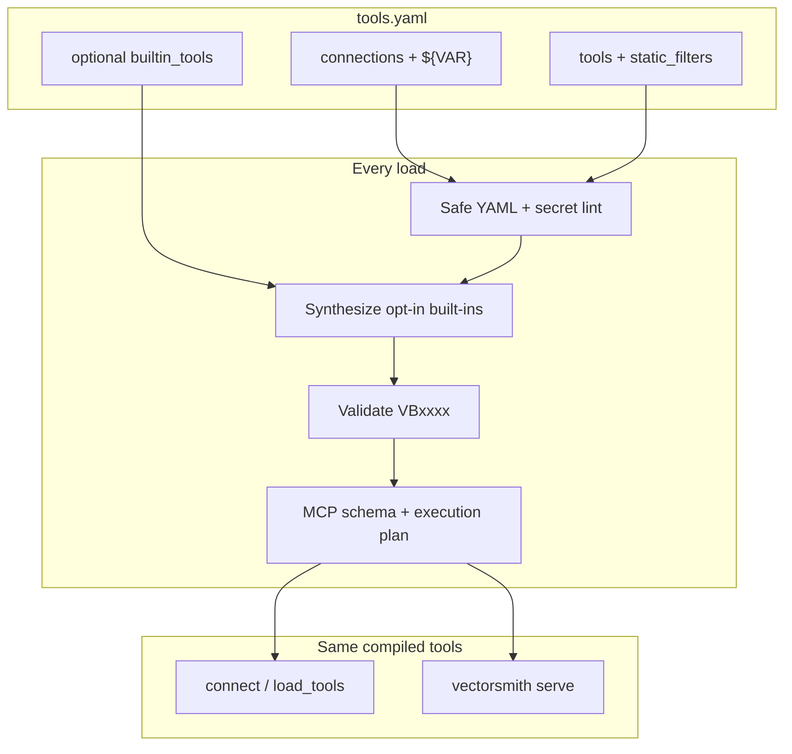

# How VectorSmith is put together

Hub: [documentation home](index.md).

VectorSmith is a **compiler**, not a gateway and not a second copy of your database.

## What you own

- The vector / table store (one of six backends — [vector stores](vector-stores.md))
- The YAML contract (who may search what, with which filters)
- Secrets in env files (`${VAR}` only on [allowed interpolation paths](tools-yaml-reference.md#interpolation-paths))

## What VectorSmith owns

- Interpolation, dtype×op matrix, capability gates
- Hidden `static_filters` (tenant isolation the model cannot omit)
- Request-scoped `security.tenancy` (claim or header) ANDed on every call, including `run_tool`
- Limits, field projection, optional pipelines (retrieve then Polars)
- MCP advertisement (`tools/list`; by default also `list_available_tools` / `run_tool` — same validation path as named tools; `--no-meta-tools` to omit)
- Request auth (HTTP JWT / API key / builtin OAuth), RBAC, rate limits, credential resolvers, audit / traces / metrics
- `profiles.enterprise` hardening at `serve` and `connect` (refuse start if the YAML is not production-safe)
- In-process wrappers for LangChain, LangGraph, OpenAI Agents, Anthropic

The executor (`Engine`) runs **inside** `serve`, `test`, `validate --live`, and `connect` / `load_tools`. Application code does not import it.

Backend behavior is not inferred from a shared interface alone. Each adapter
has explicit capability and support-level metadata. The live
[conformance suite](conformance.md) seeds one deterministic source dataset and
compares native filtering, isolation, pagination, counts, projection, and
ranking with an independent oracle. Unsupported behavior is rejected during
compilation or capability-gated in tests.

The experimental `discover`, `eval`, and `drift` commands form a local
contract-lifecycle prototype around the same compiler and executor. They can
propose drafts, exercise checked-in scenarios, and compare schema snapshots,
but they cannot auto-promote a tool.

## Two doors, one contract

| Door | Process | Who |
|---|---|---|
| `load_tools` / `connect` | Your Python process | LangChain, LangGraph, Agents SDK, Anthropic SDK, custom loops |
| `vectorsmith serve` | Child process the host spawns | Claude Desktop, Claude Code, Codex, Cursor, claude.ai (`--http`) |

You do not copy `inputSchema` into the LLM SDK. You do not merge VectorSmith into Slack/GitHub MCP — those stay sibling servers ([coexistence](coexistence.md)).

## Packages

| | Role |
|---|---|
| **`vectorsmith`** (PyPI) | CLI + public `connect` / `load_tools`. Ships `vectorsmith_core` in the same wheel. |
| `packages/core` | Source for the compiler; not a PyPI project. `load_project` is for authoring/CI. |

`vectorsmith_core` must not import the CLI (import-linter).

## What is not in this repo

Cloud dashboard, hosted VectorSmith, and write tools on your store. OSS is **read-only** tools from YAML. `0.2.0` is the production HTTP server cut (probes, JWT, OTel, Helm) — still not a hosted SaaS.

## Read next

[Library surface](library.md) · [tools.yaml](tools-yaml-reference.md) · [CLI](cli.md) · [Python API](python-api.md) · [Enterprise](enterprise.md) · [Getting started](getting-started.md)
