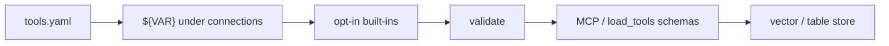

# tools.yaml

Hub: [documentation home](index.md). This page is the **field-by-field contract**. For a walkthrough, see [getting started](getting-started.md).

VectorSmith’s project config is a YAML file. The conventional name is **`tools.yaml`**. You can call it anything (`tools.invoices.yaml`, `billing.yml`) — the CLI and `load_tools` take the path you pass.

The file is a **Tool Definition Schema (TDS)**. It declares:

1. How to reach a data store (`connections`)
2. Which **read-only** tools an agent may call (`tools`)
3. Guardrails the model never sees (`static_filters`, limits, field projection)
4. Optional production knobs (`security`, `observability`, `profiles.enterprise`) — applied at `serve` / `connect`, not only `validate`

You do not write Python for those tools. VectorSmith compiles the YAML into MCP schemas (for Claude / Codex / Cursor) or in-process tools (`load_tools` / `connect`). Same file, both paths — [integrations](integrations/README.md).

```bash
vectorsmith init ./demo          # writes tools.yaml + .env.example
vectorsmith validate tools.yaml --env-file .env
vectorsmith test tools.yaml search_invoices --args '{"query":"Globex","limit":3}'
```

Worked files: [`examples/qdrant_invoices/tools.invoices.yaml`](https://github.com/kjgpta/vectorsmith/tree/main/examples/qdrant_invoices/tools.invoices.yaml), [`tools.tickets.yaml`](https://github.com/kjgpta/vectorsmith/tree/main/examples/qdrant_invoices/tools.tickets.yaml).

---

## How VectorSmith uses the file

On `validate`, `serve`, `test`, `load_tools`, or `connect`:

1. **Read** — Safe YAML only. Max 1 MB, depth 20, 100 anchors. Root must be a mapping.
2. **Interpolate** — `${VAR}` and `${VAR:-default}` only on the [allowed paths](#interpolation-paths). Anywhere else, a `${…}` string is an error (`VB1003`). The env map is: CLI `--env-file` only; Python `os.environ` + `env=` + `env_file=`.
3. **Lint secrets** — Literal values beneath credential-bearing connection keys
   (`api_key`, `auth_token`, `token`, `password`, `dsn`) are checked for API
   keys, DSNs with passwords, and high-entropy secrets. Put them in the
   environment or `--env-file`.
4. **Parse** — Pydantic models (`tds_version: "1"` or `"2"`). v1 still loads with **VB0002**. Unknown keys are **warnings** (`VB0001`), not hard errors.
5. **Synthesize built-ins** — Opt-in `builtin_tools` become extra tools (`search_<connection>`, …). They never appear as entries you typed under `tools:`.
6. **Validate** — Names, kinds, dtype×op, backend capabilities, hybrid, pipelines. All issues are collected (`VBxxxx`).
7. **Compile** — Each tool becomes an MCP `inputSchema` plus an execution plan (filters, embedding, limits).

The agent only sees the compiled schema (name, description, parameters). It does not see `static_filters`, connection URLs, or credentials.



---

## Minimal file

```yaml
tds_version: "1"

connections:
  invoices:
    backend: qdrant
    url: ${QDRANT_URL}
    api_key: ${QDRANT_API_KEY:-}

tools:
  - name: search_invoices
    kind: search
    description: >
      Search invoices by free text and filter by client or status.
      Use when the user asks about invoices, billing, or payments.
    target: { connection: invoices, collection: invoices }
    query: { param: query, required: false }
    parameters:
      - { name: client, path: client_name, dtype: keyword, op: eq }
```

`vectorsmith init` writes a slightly richer starter (built-ins on, sample search tool).

---

## Top-level keys

| Key | Required | Meaning |
|---|---|---|
| `tds_version` | yes | `"1"` (deprecated, **VB0002**) or `"2"`. v2 is **not** a structural break — same JSON Schema plus a `$comment`. `migrate` only sets `tds_version: "2"`, seeds `meta`, and rewrites bare `static_filters` lists to `{must: [...]}`. |
| `connections` | yes | Named stores. A tool’s `target.connection` must be one of these keys. |
| `tools` | no | User-authored tools. Empty is valid if you only enable built-ins. |
| `defaults` | no | Default embedding model. |
| `authoring` | no | Allow Claude to *draft* new tools (`define_tool`). Drafts never write this file until `vectorsmith approve`. |
| `security` | no | Tenancy, auth defaults, RBAC, rate limits. |
| `observability` | no | Audit, optional tracing, optional Prometheus metrics. Never includes row payloads or credentials. |
| `profiles` | no | `profiles.enterprise.security.hardening`. `validate --profile enterprise` **and** `serve` apply it (meta/authoring off; refuse start if tenancy / limit_max fail). |
| `meta` | no | Catalog version + deprecated tool list (TDS v2). |

One file = one project = one `serve --name` (one MCP connector) or one `load_tools(...)` source. Two collections you want as separate connectors → two files (this repo: invoices + tickets).

---

## Connections

Each entry is a named handle. Tools point at it; they do not repeat URLs.

```yaml
connections:
  invoices:
    backend: qdrant
    url: ${QDRANT_URL}
    api_key: ${QDRANT_API_KEY:-}
```

### Interpolation paths

`${VAR}` is legal only here (elsewhere → **VB1003**):

| Path | Examples |
|---|---|
| `connections.*` | `url`, `api_key`, `dsn`, `host` |
| `defaults.embedding.config.*` | `api_key`, `base_url` |
| `tools[].query.embedding.config.*` | same |
| `tools[].query.expand.config.*` | LLM API key / URL |
| `tools[].rerank.config.*` | rerank API key / URL |
| `security.auth.*` | `jwks_url`, `keys_file` |
| `security.rate_limit.redis_url` | Redis for shared quotas |
| `observability.audit.url` / `.path` | Audit sink |
| `observability.tracing.endpoint` | OTLP |

### Secrets

Allowed **only** under `connections` (and embedding / expand / rerank `config` as `${VAR}`):

| Form | Result |
|---|---|
| `${QDRANT_URL}` | Required. Missing → load fails (`MissingEnvError`). |
| `${QDRANT_API_KEY:-}` | Optional; empty string if unset. |
| `${QDRANT_URL:-http://localhost:6333}` | Default if unset. |
| `api_key: sk-live-…` | Rejected (looks like an inline secret). |

Secret linting is intentionally scoped to credential-bearing keys, including
those nested below them. Ordinary descriptive and URL fields are not scanned
as generic high-entropy text; do not embed credentials in a URL merely because
the loader does not classify that field as a credential.

CLI: `--env-file .env` (only keys in that file — the process environment is **not** merged). Python: `load_tools(..., env_file=".env")` or `env={"QDRANT_URL": "…"}` **does** merge `os.environ`, then `env`, then the file.

### Backend fields

`backend` is the discriminator. Six stores ship in the package — [vector stores](vector-stores.md) (install extra, capabilities, hybrid).

| `backend` | Required fields | Optional |
|---|---|---|
| `qdrant` | `url` | `api_key` |
| `pgvector` | `dsn` | `table`, `vector_column` (default `embedding`), `mode` (`vector` \| `table`), `id_column` (default `id`) |
| `chroma` | `url` | `auth_token` |
| `pinecone` | `api_key`, `host` | `namespace` |
| `weaviate` | `url` | `api_key`, `tenant`, `embedding_mode` (`auto` \| `client` \| `server`) |
| `milvus` | `uri` | `token`, `user`, `password`, `database` |

**pgvector table mode** — `mode: table` or `vector_column: null`. No vector column, so `kind: search` and `query:` are rejected (`VB2016`). Use `lookup` / `count` / `scroll` / `pipeline`.

**Weaviate embedding mode** — `auto` uses the collection vectorizer when native
introspection proves one is configured and otherwise embeds locally. `server`
requires a collection vectorizer and fails closed for self-provided vectors;
`client` always uses the configured VectorSmith embedder.

Every connection also accepts `builtin_tools`, `builtin_defaults`, and `credentials` (below).

### `credentials`

Default `provider: env` — values come from interpolated YAML / `--env-file`.

```yaml
connections:
  invoices:
    backend: qdrant
    url: ${QDRANT_URL}
    credentials:
      provider: vault            # env | vault | aws_sm | k8s
      vault:
        addr: ${VAULT_ADDR:-}
        path: secret/data/qdrant
        role: vectorsmith
      aws_sm:
        secret_id: vectorsmith/qdrant
        region: us-east-1
      k8s:
        secret: vectorsmith-qdrant
        namespace: vectorsmith
```

`serve` / `connect` / `test` / `introspect` use `build_credential_resolver`:

| Provider | How secrets are read | Validate |
|---|---|---|
| `env` | `${VAR}` from `--env-file` / `env=` | — |
| `vault` | HTTP GET `{VAULT_ADDR}/v1/{path}` with `VAULT_TOKEN` (KV v2 `data.data`) | **VB4040** if `vault.path` missing |
| `aws_sm` | AWS Secrets Manager JSON (`vectorsmith[creds-aws]`) | **VB4041** if `secret_id` missing |
| `k8s` | In-cluster `Secret` via the service account | **VB4042** if `k8s.secret` missing |

Secret payload keys must match connection fields (`url`, `api_key`, `dsn`, …). TTL cache is **per process**. Do not put live vault tokens in YAML.

### Many connections in one file

```yaml
connections:
  invoices:
    backend: qdrant
    url: ${QDRANT_URL}
  warehouse:
    backend: pgvector
    dsn: ${PG_DSN}
    table: invoices
    mode: table
```

That is still **one** MCP server. Each tool picks one `target.connection`. Two connector names in Claude → two YAML files and two `serve --name` processes.

---

## Built-in tools (opt-in)

All four default to **false**. Enable only what you want. Names are derived from the **connection key**, not the collection.

| Flag | Synthesized tool | Kind |
|---|---|---|
| `semantic_search` | `search_<name>` | search, required `query` |
| `get_by_id` | `get_<name>_by_id` | lookup, required `id` |
| `count` | `count_<name>` | count |
| `list_collections` | `list_<name>_collections` | meta |

```yaml
connections:
  main:
    backend: qdrant
    url: ${QDRANT_URL}
    builtin_tools:
      semantic_search: true
      get_by_id: true
    builtin_defaults:
      collections: [invoices]    # one name ⇒ no collection argument
      static_filters:
        - { path: tenant, op: eq, value: acme }
      output: { limit_default: 10, limit_max: 50 }
      descriptions:
        semantic_search: >
          Search ACME invoices by meaning when no more specific tool fits.
```

`builtin_defaults.collections`:

- **One** name — collection is fixed; no `collection` parameter.
- **Several** names — required `collection` enum.
- **Omitted** — required free-string `collection`.

If you also write a user tool named `search_main` while `semantic_search` is on, compile fails (`VB2010`). The invoice/ticket examples omit built-ins for that reason (`search_invoices` is a user tool).

Unrestricted `semantic_search` next to your own search tools warns (`VB3003`). Prefer tenant `static_filters` on built-ins (`VB3004`).

---

## `defaults`

```yaml
defaults:
  embedding: fastembed/BAAI/bge-small-en-v1.5
  # or:
  # embedding:
  #   provider: openai          # fastembed | openai | azure_openai | http | cohere
  #   model: text-embedding-3-large
  #   dims: 3072                # required for unknown / http models
  #   config:
  #     api_key: ${EMBED_API_KEY}
  #     base_url: ${EMBED_BASE_URL:-}
```

A string is still the FastEmbed (or `openai/` / `cohere/` prefixed) model id. Object form sets `provider`, `model`, optional `dims`, and `config`. `${VAR}` is allowed under **`config` only** (same secret lint as connections). Per-tool `query.embedding` (string or object) **wins**.

Install `vectorsmith[embed-openai]` or `vectorsmith[embed-cohere]` for those providers (**VB2019** if missing). HTTP uses `httpx` (already a core dep).

The collection’s vector size must match. `validate --live` errors **VB2017** on dim mismatch, warns **VB2018** if the model id is unknown and `dims` was omitted. `validate --live-embed` POSTs one probe text and checks the returned length.

---

## `authoring`

```yaml
authoring:
  define_tool: true
```

Enables `describe_collection` and `define_tool` on `serve`. Equivalent: `vectorsmith serve … --enable-define` (either the YAML flag **or** the CLI flag is enough).

Claude can propose a tool; the server writes **`tools.drafts.yaml` in the process working directory** (set `cwd` in Desktop/Codex). Cap **10** pending drafts; pending drafts older than **30 days** expire. Promote with `vectorsmith approve NAME [--file tools.yaml]` (that is the only path that edits `tools.yaml`). `approve` interpolates connections with an empty env map — use `${VAR:-default}` in that file or interpolation fails.

`approve --dry-run` prints a JSON semantic summary without changing either file. Approval preserves
YAML comments/formatting, increments `meta.tool_catalog_version`, retains deprecation
metadata, and records approver/time/hash provenance in the draft record.

Phase 2 local prototypes require an explicit flag and never auto-promote:

```bash
vectorsmith discover tools.yaml --connection main --experimental
vectorsmith eval tools.yaml scenarios.yaml --experimental
vectorsmith drift tools.yaml schema.json --connection main --experimental
```

`discover` writes pending schema-backed proposals, supported operators, and
likely tenant fields to `tools.discovered.drafts.yaml` by default (or `--out`);
this is separate from the `./tools.drafts.yaml` used by MCP `define_tool` and
`approve`. Review and deliberately move an accepted proposal into the approval
workflow. `eval` executes checked-in calls through the normal engine and checks
tool/argument, row, isolation-value, and score invariants. It does not currently
inject a request `CallContext`. `drift` compares a metadata-only export with
live introspection and writes suggestions; it does not edit the catalog.

`kind: meta` is never user-authorable.

---

## Tools

```yaml
tools:
  - name: search_invoices
    kind: search
    description: >
      Search invoices by free text and filter by client, status, or amount.
      Use when the user asks about invoices, billing, or payments.
    target: { connection: invoices, collection: invoices }
    query: { param: query, required: false }
    static_filters:
      - { path: tenant, op: eq, value: acme }
    parameters:
      - { name: client, path: client_name, dtype: keyword, op: eq }
      - { name: status, path: status, dtype: keyword, op: in,
          enum: [draft, sent, paid, overdue] }
      - { name: min_amount, path: amount, dtype: float, op: gte }
    output:
      fields: [invoice_id, client_name, status, amount]
      limit_default: 10
      limit_max: 50
```

### `name`

`^[a-z][a-z0-9_]{2,63}$` — unique in the file. Blocked if a built-in of that name is enabled (`VB2010`). Also reserved (even if not advertised today): `ping`, `define_tool`, `describe_collection`, `list_available_tools`, `run_tool`, `list_my_connections`, `get_started`.

By default `serve` advertises `list_available_tools` and `run_tool` **in addition to** your compiled tools (Claude Desktop freeze workaround). Those two are MCP-only; `load_tools` does not expose them. `run_tool` re-validates arguments against the named tool and still applies `static_filters`. Pass `--no-meta-tools` to omit them. With authoring on, `serve` also advertises `describe_collection` and `define_tool`.

### `description`

20–1024 characters (hard). Aim for **when to pick this tool**, not a restatement of the name. Under 40 characters or “same as the name” → warnings (`VB3001`, `VB3002`). Claude / Codex choose among tools by this text.

### `kind`

| Kind | Purpose | Shape |
|---|---|---|
| `search` | Semantic (or filter-only) retrieve | `target` required; `query` optional |
| `lookup` | Fetch by exact key | `target`; no `limit` arg on the schema. `output.limit_default` other than 1 warns (`VB2006`) but is not rewritten |
| `count` | Count matching rows | `target`; no row payload |
| `scroll` | Filter / page without ANN | `target`; no `query` |
| `pipeline` | Retrieve then in-process steps | `steps` required; **no** `target` on the tool |
| `meta` | Built-in only (`list_*_collections`) | User files cannot declare this (`VB2014`) |

Default `kind` is `search`.

### `target`

```yaml
target: { connection: invoices, collection: invoices }
```

`connection` must exist. `collection` is a string for user tools (dynamic collection params are synthesis-only, `VB2015`).

### `query`

Present = this tool can take a text string and embed it.

| Field | Default | Meaning |
|---|---|---|
| `param` | `query` | Argument name on the compiled schema |
| `required` | `false` | If false and omitted at call time → filter-only retrieve |
| `embedding` | `defaults.embedding` | Model id string, or `{provider, model, dims, config}` |
| `mode` | `dense` | `dense` or `hybrid` |
| `alpha` | `0.5` | Hybrid mix, 0–1 |
| `min_score` | | Drop hits below this score (`0`–`1`). Qdrant gets `score_threshold`; others post-filter (**VB2022** if out of range; **VB2004** warning if the backend has no native threshold) |
| `ef` | | HNSW `ef` where supported (Qdrant). **VB2023** warning on other backends |
| `expand` | off | Optional LLM rewrite. See below. |

`mode: hybrid` needs a backend that currently advertises hybrid (Qdrant or
Weaviate) **and** sparse vectors on the collection. Confirm with
`vectorsmith validate --live` (`VB2012` / `VB2013`). Chroma, pgvector,
Pinecone, and Milvus do not currently advertise hybrid.

#### `query.expand`

Off by default. When `enabled`, the engine asks a provider for up to `variants` (1–5) rewrites, embeds **original + variants**, searches each, and keeps the best `_score` per id. Expand counts against `security.rate_limit.per_principal.llm_requests_per_minute` when set. Failure → original query only + **VB4030**.

```yaml
query:
  param: query
  expand:
    enabled: true
    provider: openai          # openai | http | none
    model: gpt-4o-mini
    variants: 3
    config:
      api_key: ${LLM_API_KEY}
      base_url: ${LLM_BASE_URL:-}
      prompt: |
        Rewrite this search query into {variants} diverse phrases.
        Query: {query}
        Return JSON array of strings.
```

`provider: none` with `enabled: true` is a no-op (original query only) unless a test hook is attached.

### `parameters`

Up to 12. Each becomes an argument on the tool schema. If the caller omits an optional param, that filter is dropped.

| Field | Rule |
|---|---|
| `name` | `^[a-z][a-z0-9_]{0,31}$`, unique per tool |
| `path` | Payload / column path, up to 3 segments (`client_name`, `meta.region`). Nested paths require a backend that supports them (not Chroma / Pinecone). |
| `dtype` | `keyword` · `integer` · `float` · `boolean` · `datetime` · `keyword[]` |
| `op` | See operators below |
| `required` | Default `false` |
| `description` | Shown on the compiled schema |
| `enum` | ≤ 100 values; steers the model. Unusual with ops other than `eq`/`ne`/`in`/`nin` (`VB2005`). |
| `default` | Compiled into the JSON schema |
| `max` | Upper bound for numeric params |
| `resolve` | Optional fuzzy / enum lookup. See below. |

`in` / `nin` / `contains_*` compile as JSON arrays. `datetime` compiles as `string` + `format: date-time`.

#### `parameters[].resolve`

```yaml
parameters:
  - name: client
    path: client_name
    dtype: keyword
    op: eq
    resolve:
      kind: directory          # directory | enum
      connection: invoices     # default: tool target
      collection: invoices
      field: client_name
      min_confidence: 0.72
      max_candidates: 5000
      cache_ttl_s: 600
```

- `enum` — exact match against the parameter `enum` list; no store round-trip.
- `directory` — scroll distinct values, then fuzzy-match (`difflib`). Exact `enum` hits skip scroll. Unresolved → empty result, **VB4020**, and `message` with alternatives (not an exception). **VB4021** if the backend cannot scroll (Pinecone). The MCP schema **omits** `enum` when `kind: directory` so typos can reach the resolver. Distinct-value cache is **in-process** (TTL `cache_ttl_s`); each replica samples again after expiry. There is no Redis-shared cache today.

### Operators

**Every backend:** `eq` `ne` `gt` `gte` `lt` `lte` `in` `nin`.

**Extended** (capability-gated, `VB2004` if the store cannot do it): `exists` `is_null` `contains_any` `contains_all` `like` `text_match`.

| dtype | Allowed ops |
|---|---|
| `keyword` | `eq` `ne` `in` `nin` `like` `text_match` |
| `integer` / `float` / `datetime` | `eq` `ne` `gt` `gte` `lt` `lte` `in` `nin` |
| `boolean` | `eq` `ne` |
| `keyword[]` | `in` `nin` `contains_any` `contains_all` |

Qdrant also allows `exists` / `is_null` / `text_match`. pgvector adds `like`.
Qdrant, pgvector, Pinecone, Weaviate, and Milvus support
`contains_any` / `contains_all`; Chroma rejects `keyword[]` filters. See the
[generated backend matrix](vector-stores.md#what-each-backend-can-do) for the
full contract.

`filter_logic` is always `and` (the only legal value). Optional params that are absent are not part of the AND.

### `static_filters`

Applied on **every** call, including through MCP `run_tool`. Not advertised to the model. Use for tenant / org isolation on **payload fields**. Pinecone namespaces and Weaviate native tenants are separate — [vector stores](vector-stores.md#tenancy-vs-payload-filters).

```yaml
static_filters:
  - { path: tenant, op: eq, value: acme }
  - { path: status, op: eq, value: overdue }   # named “overdue only” tool

# equivalent object form — must_not excludes rows
static_filters:
  must:
    - { path: tenant, op: eq, value: acme }
  must_not:
    - { path: archived, op: eq, value: true }
```

A bare list is shorthand for `must`. Do not mix a list with `must`/`must_not` keys (**VB2021**). `must_not` ops are the LCD set (`eq` `ne` `gt` `gte` `lt` `lte` `in` `nin`) — anything else is **VB2020**. Neither form appears in the MCP schema. Values are literals, not `${VAR}`.

### `security.tenancy`

Request-scoped payload isolation. The value comes from the authenticated caller (JWT claim or HTTP header), not from the model. The compiled MCP schema never lists this field.

```yaml
security:
  tenancy:
    mode: claim                 # none | static | claim | header
    claim: tenant_id            # required when mode is claim (VB4011)
    header: X-Tenant-Id         # used when mode is header
    path: tenant_id             # payload field
    op: eq                      # eq only
    enforce: strict             # strict | override | warn
```

| `mode` | Meaning |
|---|---|
| `none` / `static` | Compile-time `static_filters` only (default). |
| `claim` | AND `{path} eq claims[claim]` on every `engine.call` / `run_tool`. |
| `header` | Same, from the named HTTP header. |

`enforce: strict` rejects a model argument that conflicts with the tenancy path (**VB4010**). `override` replaces it silently; `warn` replaces it and adds a result warning. **VB4012** warns at `validate` if a tool parameter uses the same path.

Request-scoped modes need HTTP plus caller identity (`claim` needs JWT / API-key claims). Stdio and `load_tools` have no caller principal; keep `mode: none` or `static` there.

### `security.auth`

Optional. CLI `--auth` / `--jwks-url` / `--api-keys-file` are the source of truth at serve time; YAML fills defaults. `${VAR}` is allowed under `security.auth` (e.g. `jwks_url: ${JWKS_URL}`).

```yaml
security:
  auth:
    mode: jwt                    # documentation; pass --auth jwt
    jwt:
      issuer: https://auth.example.com
      audience: vectorsmith
      jwks_url: ${JWKS_URL}
      algorithms: [RS256, ES256]
      principal_claim: sub
    api_key:
      header: Authorization
      scheme: Bearer
      keys_file: ${API_KEYS_FILE}
```

### `security.rbac`

Off by default. When `enabled: true`, every `engine.call` / `run_tool` checks the caller's role claim against `roles.*.allow`. `deny_tools` wins even for `allow: ["*"]`.

```yaml
security:
  rbac:
    enabled: true
    default_role: viewer
    role_claim: roles
    roles:
      viewer:
        allow: [search_invoices]
      admin:
        allow: ["*"]
    deny_tools: [define_tool]
```

**VB4013** if enabled with no roles. **VB4014** warning if an allow list names an unknown tool. `list_available_tools` / `run_tool` themselves are not allow-gated; the inner `run_tool` name is.

### `security.rate_limit`

Off by default. When enabled, `engine.call` counts global, per-principal, and per-tool windows. HTTP maps `RateLimited` to **429** with `retry_after_s`.

```yaml
security:
  rate_limit:
    enabled: true
    store: memory                 # memory | redis
    redis_url: ${REDIS_URL:-}
    global:
      requests_per_minute: 120
    per_principal:
      requests_per_minute: 60
      embed_requests_per_minute: 30
      llm_requests_per_minute: 10
    per_tool:
      search_invoices: 30/minute
```

### `observability.audit`

JSONL events for each named tool call (not the `run_tool` envelope). Failures include `error_code`. Rows and credentials are never logged. Redacted arg names become `[REDACTED]`. A sink error does not fail the tool.

```yaml
observability:
  audit:
    enabled: true
    sink: file                 # stdout | file | http | otlp
    path: /var/log/vectorsmith/audit.jsonl
    redact:
      arg_fields: [password, token, secret]
```

CLI: `--audit-log PATH`, `--audit-sink http --audit-url URL`. File sink is mode `0600`. `sink: http` POSTs the JSONL event as the request body. `sink: otlp` POSTs [OTLP HTTP JSON logs](https://opentelemetry.io/docs/specs/otlp/) to `{url}/v1/logs` (collector), not a raw audit document. Multi-project `serve` uses each YAML's audit block unless you pass a CLI `--audit-*` override (then the first file + flags win).

### `observability.tracing` / `metrics`

Both off by default (no spans, no counters). Extra: `vectorsmith[otel]`.

```yaml
observability:
  tracing:
    enabled: false
    exporter: otlp
    endpoint: ${OTEL_EXPORTER_OTLP_ENDPOINT:-http://localhost:4318}
    service_name: vectorsmith
  metrics:
    enabled: false
    port: 9090
```

When `tracing.enabled` is true, `serve` and `connect` export spans. `exporter: otlp` uses `endpoint` (default `http://localhost:4318` → `/v1/traces`) via `vectorsmith[otel]`. `exporter: console` prints spans. Extra missing → no-op / console fallback.

When metrics are on, HTTP serve exposes `GET /metrics`.

### `profiles`

```yaml
profiles:
  enterprise:
    security:
      hardening:
        disable_authoring: true
        disable_meta_tools: true
        require_tenancy: true
        max_limit_max: 100
        allowed_backends: [qdrant, pgvector]
```

Used by `vectorsmith validate --profile enterprise` (same rules as `--enterprise`) **and** by `serve` / `connect` / `load_tools`: `disable_authoring` / `disable_meta_tools` override CLI flags; `require_tenancy` / `max_limit_max` / `allowed_backends` refuse start (or raise from `connect`). Multi-project `serve` **unions** every YAML: any file that disables authoring/meta wins; tracing/metrics turn on if any file enables them. See [security hardening](security-hardening.md).

### `output`

| Field | Default | Meaning |
|---|---|---|
| `fields` | all returned | Projection the agent sees |
| `limit_default` | 10 | 1–500 |
| `limit_max` | 50 | 1–500 |
| `include_score` | `true` | Similarity score when the kind is a search |
| `include_id` | `true` | Keep `_id` even when `fields` is set |
| `max_field_length` | | Truncate string fields; `truncate_suffix` default `…` |
| `redact` | | Per-path `omit` / `hash` / `mask` / `pattern` after fetch |

For Chroma, the stored document body is exposed as the reserved `_document` field.
Add `_document` to `fields` when using an explicit projection. A metadata field named
`content` remains metadata and is not overwritten.

```yaml
output:
  fields: [invoice_id, client_name, notes]
  redact:
    - { path: notes, mode: mask }
    - { path: ssn, mode: omit }
    - { path: email, mode: hash }
    - path: body
      mode: pattern
      patterns:
        - { regex: '\b\d{16}\b', replacement: '[PAN]' }
  max_field_length: 400
  truncate_suffix: "…"
```

Applied after projection, before the byte cap and audit. Modes: `omit` (drop field), `hash` (sha256 hex prefix), `mask` (keep last 4), `pattern` (regex replace).

### `rerank`

Off by default. When `enabled`, the adapter retrieves `retrieve_k` hits, then a hook reorders to `output.limit`. Failure keeps vector order and adds **VB4031**.

```yaml
rerank:
  enabled: false
  provider: http          # cohere | cross_encoder | http
  model: rerank-english-v3.0
  retrieve_k: 50
  config:
    api_key: ${COHERE_API_KEY:-}
    base_url: ${RERANK_URL:-}
```

`http` needs `config.base_url`. `cohere` needs `vectorsmith[embed-cohere]`. `cross_encoder` is local (`sentence-transformers`, extra `vectorsmith[rerank-local]`); missing extra is **VB4032** (warning) and a runtime **VB4031** keep-order fallback. Unknown providers no longer fall through to HTTP.

For `search` / `scroll` / `pipeline`, VectorSmith adds a `limit` argument (integer, default/max from `output`). Lookup / count / meta do not get that argument.

---

## Pipeline tools

Use a pipeline when one retrieve is not enough: filter in-process, top-N per group, sort, project.

```yaml
  - name: top_overdue_by_client
    kind: pipeline
    description: >
      For each client, the largest overdue invoices, optionally matching a text query.
      Use when the user asks who owes the most past-due amount.
    steps:
      - retrieve:
          target: { connection: invoices, collection: invoices }
          query: { param: query, required: false }
          fetch: { k_param: limit, overfetch_factor: 10, max_candidates: 2000 }
      - post_filter: { expr: "amount > 0 AND days_overdue >= params.min_days" }
      - group_by:
          keys: [client_name]
          per_group: { sort_by: amount, desc: true, take: 3 }
      - sort: { by: amount, desc: true }
      - project: { fields: [client_name, invoice_id, amount, days_overdue] }
    parameters:
      - { name: min_days, dtype: integer, default: 30 }
    output:
      limit_default: 20
      limit_max: 100
    static_filters:
      - { path: tenant, op: eq, value: acme }
      - { path: status, op: eq, value: overdue }
```

Rules:

- First step **must** be `retrieve` (`VB2101`). The tool itself has no `target`.
- Later steps run in-process (Polars), not in the vector DB.
- After `post_filter`, if too few rows remain, the engine over-fetches (`overfetch_factor`, widen ×3, up to 3 attempts, cap `max_candidates`) and may set `may_be_incomplete` on the result so the model can caveat.
- Put the text argument on the **retrieve** step (`query.param` / `query.required`). `mode`, `alpha`, and `embedding` are taken from a **tool-level** `query:` if you set one; `retrieve.query.mode` is not compiled.

| Step | Fields |
|---|---|
| `retrieve` | `target`, optional `query`, optional `filter`, `fetch` |
| `post_filter` | `expr` (non-empty) |
| `group_by` | `keys` (1–3 paths), optional `per_group.{sort_by,desc,take}` |
| `sort` | `by`, `desc` (default true) |
| `project` | `fields` (at least one) |

`fetch`: `k_param` (default `limit`), `overfetch_factor` 1–50 (default 10), `max_candidates` 10–20000 (default 2000).

### `expr` (post_filter only)

Comparisons `== != > >= < <=`, `AND` `OR` `NOT`, arithmetic `+ - * /`, number/string/bool literals, bare field names, `params.<name>`. No function calls, no indexing, no I/O. Parsed by a fixed grammar and compiled to Polars — not `eval`.

---

## What the agent actually sees

A compiled search tool looks like this (simplified):

```json
{
  "name": "search_invoices",
  "description": "Search invoices by free text and filter by client, status, or amount. …",
  "inputSchema": {
    "type": "object",
    "properties": {
      "query": { "type": "string" },
      "client": { "type": "string" },
      "status": { "type": "array", "items": { "type": "string", "enum": ["draft", "sent", "paid", "overdue"] } },
      "min_amount": { "type": "number" },
      "limit": { "type": "integer", "minimum": 1, "maximum": 50, "default": 10 }
    },
    "required": []
  }
}
```

`tenant: acme` is **not** in the schema. The engine always ANDs it.

Return envelope (in-process `call` / MCP tool result): `rows`, `count`, `truncated`, `may_be_incomplete`, `search_mode`, `warnings`, `latency_ms`, optional `message` (e.g. directory-resolve alternatives).

---

## Patterns

**Tenant isolation** — put org id in `static_filters` on every tool and on `builtin_defaults`. Do not rely on the model to pass `tenant`. That is a **payload** predicate compiled into the store filter.

It is **not** the same as Pinecone’s namespace (`target.collection` / optional `connections.*.namespace`) or Weaviate’s native multi-tenancy (`connections.*.tenant` on the connection). Those are store-native partitions. Use both layers if you need them; payload `static_filters` never sets a Weaviate tenant or a Pinecone namespace. Details: [vector stores](vector-stores.md#tenancy-vs-payload-filters).

**Named slices** — a second search tool with an extra static filter (`status: overdue`, `severity: critical`) beats one mega-tool with a required enum. Descriptions should say when to use each.

**Enums** — if the field is a closed set, declare `enum`. The host’s schema becomes much tighter.

**One concern per file** — invoices vs tickets as two YAML files → two MCP names. One file with two connections is fine when you want a single connector.

**Built-ins vs user tools** — skip `semantic_search` if you already define `search_<same connection name>`, or rename the connection (`invoices_qdrant`) so the built-in is `search_invoices_qdrant`.

---

## Checking a file

```bash
# Schema, interpolations, capability matrix (no network)
vectorsmith validate tools.yaml --env-file .env

# Also ping the store: health, dims (VB2017/VB2018), sparse / hybrid (VB2013),
# payload-path drift (VB4004)
vectorsmith validate tools.yaml --live --env-file .env

# Fail CI on warnings too
vectorsmith validate tools.yaml --strict --json

# Production gate (VE001–VE007) + optional OPA packs
vectorsmith validate tools.yaml --enterprise --strict --env-file .env
vectorsmith validate tools.yaml --policy-builtin enterprise,pci,soc2

# Run one compiled tool without serving
vectorsmith test tools.yaml search_invoices \
  --args '{"query":"Globex invoice","limit":3}' --env-file .env
```

Exit codes: `0` ok · `1` strict validation warnings, failed `eval` scenarios, or
detected `drift` · `2` validation/usage errors · `3` runtime (`test`,
`introspect`, or `discover` live failure; `serve --http --auth none` off
localhost).

All current backends have experimental support status, so `VB2024` makes
strict validation non-zero until the selected adapter completes its stability
matrix. This is an intentional support gate; see
[backend conformance](conformance.md).

### Codes you will actually hit

| Code | Severity | Typical cause |
|---|---|---|
| `VB0001` | warning | Unknown YAML key (typo or future field) |
| `VB0002` | warning | `tds_version: "1"` — run `vectorsmith migrate` |
| `VB1003` | error | `${VAR}` outside [allowed paths](#interpolation-paths), or inline secret |
| `VB2001` | error | Operator illegal for that `dtype` |
| `VB2002` | error | Duplicate parameter names |
| `VB2004` | error | Backend cannot do that op or nested path |
| `VB2005` | warning | `enum` used with an unusual operator |
| `VB2006` | warning | Lookup `output.limit_default` is not 1 (schema still has no `limit` arg) |
| `VB2010` | error | Name collides with a reserved / built-in name |
| `VB2011` | error | Meta tool has query / params / filters |
| `VB2012` / `VB2013` | error / warning | Hybrid unsupported or collection has no sparse config |
| `VB2014` | error | User declared `kind: meta` |
| `VB2015` | error | Dynamic collection `ParamRef` on a user tool (synthesis-only) |
| `VB2016` | error | `search` / `query` on a pgvector table-mode connection |
| `VB2017` | error | Live collection dim ≠ known embedder dim (`validate --live`) |
| `VB2018` | warning | Embedding model id not in the dim registry (`validate --live`) |
| `VB2019` | error | Embedding provider extra is not installed |
| `VB2020` | error | `static_filters.must_not` uses an illegal operator |
| `VB2021` | error | Bare-list `static_filters` mixed with `must`/`must_not` keys |
| `VB2022` | error | `query.min_score` is not in `[0, 1]` |
| `VB2023` | warning | `query.ef` set on a backend that cannot use it |
| `VB2024` | warning | Target backend is experimental and requires version-specific verification |
| `VB2025` | error | Enabled built-in cannot preserve the backend's advertised isolation contract |
| `VB2026` | error | Live introspection found a filter path without a required explicit backend index |
| `VB4010` | error | Model argument conflicts with request tenancy (`enforce: strict`) |
| `VB4011` | error | `security.tenancy.mode: claim` without `claim` |
| `VB4012` | warning | Tool parameter path collides with `security.tenancy.path` |
| `VB4013` | error | `security.rbac.enabled` is true but no roles are defined |
| `VB4014` | warning | RBAC role `allow` list names an unknown tool |
| `VB4020` | warning | Directory resolve failed; result includes alternatives |
| `VB4021` | error | `resolve.kind: directory` on a backend that cannot scroll |
| `VB4030` | warning | Query expand failed; original query was used |
| `VB4031` | warning | Rerank failed; vector order was kept |
| `VB4032` | warning | `rerank.provider: cross_encoder` extra is not installed |
| `VB4040` | error | `credentials.provider: vault` without `vault.path` |
| `VB4041` | error | `credentials.provider: aws_sm` without `aws_sm.secret_id` |
| `VB4042` | error | `credentials.provider: k8s` without `k8s.secret` |
| `VB2101` / `VB2102` | error | Pipeline missing `retrieve` or empty `expr` |
| `VB3001`–`VB3005` | warning | Weak descriptions or overlapping built-in search |
| `VB4001` | warning | Projected field missing on a row |
| `VB4002` | warning | Pipeline `post_filter` compared a null |
| `VB4003` | warning / error | Meta count failed, or connection unhealthy on `--live` |
| `VB4004` | warning | YAML payload path not seen on live collection fields |
| `VE001`–`VE007` | error/warning | `validate --enterprise` production preset |
| `POL000` | error | `--policy` needs the `opa` CLI, or `opa eval` failed |
| `POL001` | error | Builtin pack or custom Rego `deny` |

JSON Schema for editors lives next to the models: `packages/core/vectorsmith_core/tds/schema_v1.json` and `schema_v2.json` (generated from the Pydantic types).

---

## Related

- [Library surface](library.md) — extras, HTTP routes, exceptions
- [Vector stores](vector-stores.md) — Qdrant, pgvector, Chroma, Pinecone, Weaviate, Milvus
- [Embedding providers](embedding-providers.md)
- [Enterprise](enterprise.md) · [Security hardening](security-hardening.md) · [Observability](observability.md)
- [Use in agents](use-in-agents.md) — `load_tools` vs `serve`
- [Integrations](integrations/README.md) — Claude, Codex, LangGraph, …
- [Coexistence](coexistence.md) — this file next to Slack / GitHub MCP
- [Desktop quickstart](quickstart-desktop.md)
